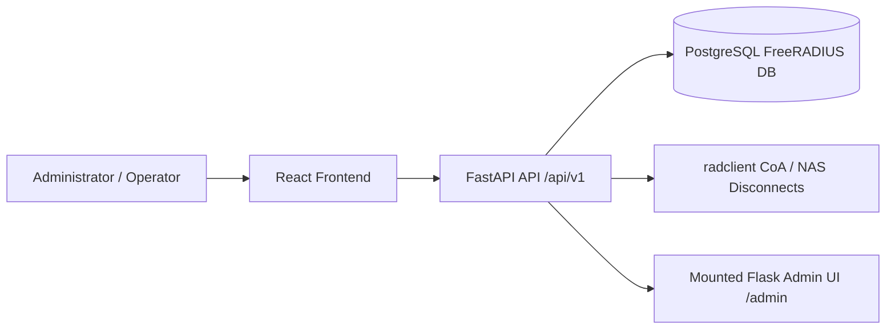

# RadiusFlow System Overview

RadiusFlow is a FreeRADIUS management system with two primary application surfaces:

1. A FastAPI backend that exposes the management API and serves the mounted Flask admin interface.
2. A React frontend that provides the browser-based operator dashboard.

The system is designed to manage users, packages, NAS devices, active sessions, authentication logs, monitoring, and notifications against an existing PostgreSQL-backed FreeRADIUS deployment.

## High-Level Architecture

The default Docker setup runs the backend on `127.0.0.1:8000` and the frontend on `127.0.0.1:8080`.

## Backend

The backend lives under [backend/](../backend). The main entrypoint is [backend/app/main.py](../backend/app/main.py), which builds the FastAPI application, enables CORS, registers API routers, and mounts the Flask-based admin UI at `/admin`.

### Main backend responsibilities

- API authentication and JWT token issuance.
- User CRUD and account lifecycle actions.
- Package and group management.
- NAS management and session control.
- Monitoring and dashboard data.
- Authentication logs and notification support.
- Health checks and system status.

### API layout

The documented API is versioned under `/api/v1`. The main router groups are:

- Auth
- Users
- Packages
- NAS
- Sessions
- Monitoring
- Logs
- Notifications
- System

Protected endpoints require `Authorization: Bearer <token>`.

### Admin UI

The backend also mounts a Flask web application at `/admin` through WSGI. This interface is used for management workflows such as the login page and admin operations that are separate from the public API.

### Configuration

Runtime configuration is loaded from environment variables in [backend/config.py](../backend/config.py). The most important values are:

- `DATABASE_URL`
- `JWT_SECRET`
- `CORS_ORIGINS`
- `API_V1_PREFIX`
- `ENVIRONMENT`
- `FLASK_SECRET_KEY`
- `AUTH_SESSION_HOURS`
- `SESSION_COOKIE_SECURE`

In production, the backend validates that the secrets are set correctly and that insecure defaults are not used.

## Frontend

The frontend lives under [frontend/](../frontend). It is a React application bootstrapped from [frontend/src/main.jsx](../frontend/src/main.jsx) and routed by [frontend/src/AppNew.jsx](../frontend/src/AppNew.jsx).

### Frontend responsibilities

- Operator login and session-based navigation.
- Dashboard and health views.
- User, package, NAS, and session administration.
- Authentication log inspection.
- Reporting and settings screens.

### Frontend routes

When authenticated, the UI exposes these main routes:

- `/dashboard`
- `/users`
- `/packages`
- `/nas`
- `/sessions`
- `/auth-logs`
- `/reports`
- `/health`
- `/settings`

Unauthenticated users are redirected to `/login`.

### Frontend stack

- React
- React Router DOM
- Axios for API requests
- Vite for development and builds

The frontend reads its API base URL from `VITE_API_URL`, which defaults to the backend API when built through Docker.

## Deployment Model

The root [docker-compose.yml](../docker-compose.yml) defines two services:

- `backend`: FastAPI application container.
- `frontend`: Static web frontend container.

The backend container depends on a reachable PostgreSQL database and performs a health check against `/api/v1/health`. The frontend container depends on the backend being healthy before it starts.

## Request Flow

1. An operator opens the React frontend.
2. The frontend authenticates against the backend API.
3. The backend validates credentials and issues a token or session state.
4. The frontend uses the authenticated API to manage users, packages, NAS records, sessions, and reports.
5. The backend persists changes to the FreeRADIUS PostgreSQL database and performs any required CoA or disconnect actions.

## Operational Notes

- The backend should be deployed behind HTTPS.
- PostgreSQL should remain private and not be exposed publicly.
- FreeRADIUS NAS secrets must be configured correctly for CoA disconnects.
- In development, the backend may create or reset a default admin user; production disables that startup behavior.

## Related Docs

- [Backend README](../backend/README.md)
- [Frontend README](../frontend/README.md)
- [Deployment Guide](../backend/DEPLOYMENT.md)